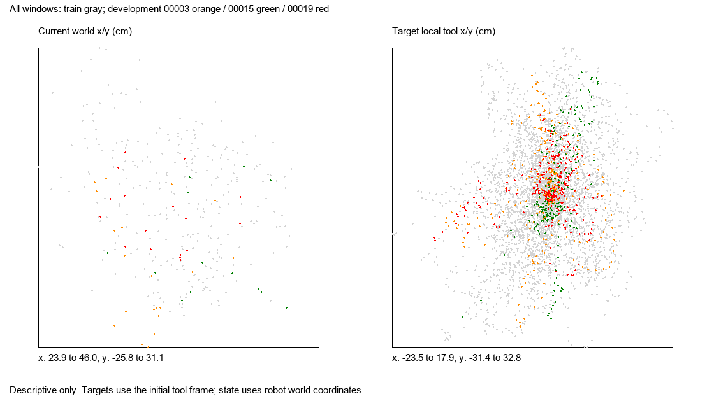

# Bridge 输入与动作范围复查

2026-10-06。只读已有 316 个训练、55 个开发窗口缓存；不训练、不读取测试目标、不加载 CLIP 权重。复用此前 371/371 个窗口的独立数值与图像审计。本次补充检查各演示首、中、末合法输入窗口共 60 张原始图像：全部图像编码哈希与审计一致，当前 xyz 与状态缓存一致。选帧不依赖模型误差或动作目标。

统计结果：[JSON](../reports/bridge_distribution_review_20261006.json)。

| 比较项 | 训练 | 开发验证 |
|---|---:|---:|
| 位移长度中位数 | 8.62 cm | 8.07 cm |
| 位移长度 95% 分位 | 23.39 cm | 23.16 cm |
| 相对旋转角中位数 | 10.29° | 10.00° |
| 相对旋转角 95% 分位 | 39.32° | 35.62° |
| 打开目标比例 | 7.14% | 8.07% |
| 超出训练 xyz 各轴目标范围 | 0/5056 | 4/880 |
| 当前 xyz 超出训练各轴范围 | 0/316 | 6/55 |

范围重叠不意味着联合分布相同。窗口重叠，独立演示只有 17/3 条；不能把动作目标数当作独立样本数。原始当前位置为机器人世界坐标，目标位移为初始末端坐标，不能直接比较两者方向。

三条开发演示最近训练当前位置的距离中位数分别为 3.13、2.58、1.50 cm，仅比较 xyz，不代表姿态、视觉或动作相同。代表图像中，白盘/木桌及黑色、蓝色、棕色物料在训练与开发两侧均出现。未观察到三条开发演示全部属于训练中完全没有的场景大类；相机角度、遮挡、物体位置与阶段仍有差异。视觉结论只覆盖固定 60 帧，不是完整场景身份或校准检验。

## 输出裁剪边界

训练中 20/5056 个动作、10/316 个窗口有 xyz 分量超过 ±30 cm 输出上限；可直接计算的平均位置误差下限仅 0.00473 cm，最大单动作下限 2.84484 cm。开发 880 个动作没有超过输出范围。这是需要记录的训练目标/输出范围不一致，但不能解释约 10 cm 的开发误差。此前数值审计已逐窗口记录这些越界数，审计通过不等于目标都在输出范围内。

## 结论与停止条件

本次未发现新的图像错配或当前位置缓存错配。已有全部窗口审计支持现行未来观测位姿与前一时刻夹爪命令合同的实现一致性，不证明合同适用于真实控制。动作幅度和粗场景范围不足以解释整体失败；不能据此排除更细的分布差异，也不能确定 CLIP、Adapter 或观测历史是根因。

当前位姿输入消融、视觉近邻、patch 汇聚检查已有历史结果，不能再次作为未做的新方案。作业 187797 的作者组最终训练拟合不足，配对结构对照仍存在限制；它没有排除动作头影响。

停止重复完整训练集记忆检查和盲目增加更新数。下一次训练前，应固定一个明确假设、受控变量和失败停止条件；同时将离线位姿预测与老师要求的完整策略、零样本任务成功率区分。历史单任务一条指令诊断无法检验语言泛化。

原始图片与一次性复查脚本保存在本地 `results/bridge_distribution_review_20261006/`，新增文件约 1 MB；没有复制数据或权重。
